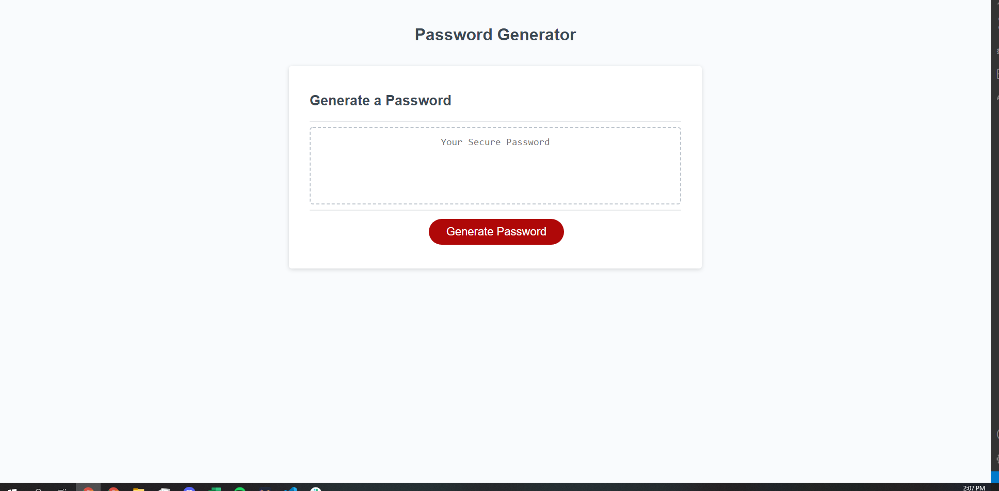
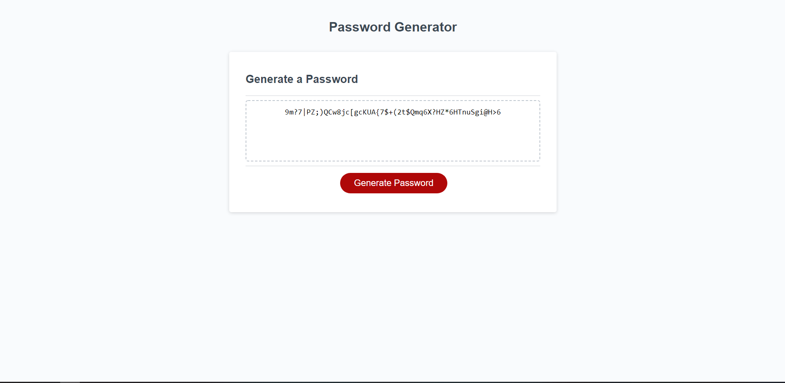

# <Your-Project-Title>

## Description
The project is meant to be a password generator for the user to be able to choose from a preset list of requirements for a password which then generates a random password for the user. I built the project to utilize the javascript functions to form a website that is able to combine differnt variables and strings together and create a complex password randomly generated by the computer. 
## Installation
I worked through javascript to create functions and prompts that ask for the users input and stores it into variables. I then take these variables to be able to create passwords that are randomly scrambled by the computer within the parameters 8 - 128 in length chracterwise. 
## Usage
I was able to create a javascript window function that allows users to ask the computer certain prompts and the computer would generate a password based on the parameters listed by the user. It helped me to understand better how to write javascript functions. 

[Link to my github Repo for challenge 3] (https://figwheymutton.github.io/Password-Generator-2/)
